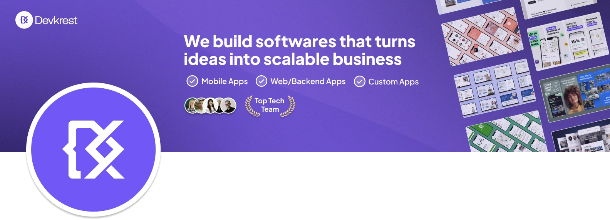

  

<h1 align="center">Engineering Digital Excellence.</h1>

We build scalable software, AI-powered solutions, and cloud-native platforms that help startups, enterprises, and growing businesses turn ambitious ideas into exceptional digital products.

---

## 👋 Welcome

At **Devkrest**, we believe technology should accelerate businesses—not complicate them.

We partner with founders, startups, and enterprises to design, develop, and scale modern software that delivers measurable business value. From launching new products to modernizing complex systems, our engineering-first approach ensures every solution is built for performance, reliability, and long-term growth.

---

# 🚀 What We Build

<table>
<tr>
<td width="50%">

### 💻 Custom Software
Tailor-made applications designed around your business goals.

### 🌐 Web Applications
Fast, responsive, and scalable web experiences.

### 📱 Mobile Apps
Cross-platform applications with native performance.

### ☁️ SaaS Platforms
Cloud-native products built to scale globally.

</td>

<td width="50%">

### 🤖 AI & Automation
Intelligent workflows powered by modern AI.

### 🏢 Enterprise Systems
CRM, ERP, dashboards, and internal business tools.

### 🔗 API Integrations
Secure APIs and seamless third-party connectivity.

### ⚙️ Cloud & DevOps
Infrastructure, CI/CD, monitoring, and deployment.

</td>
</tr>
</table>

---

# 🛠 Technology Stack

### Frontend

### Backend

### Databases

### Cloud & DevOps

---

# 💙 Our Engineering Principles

We don't just deliver features—we build products that stand the test of time.

- Architecture before complexity.
- Performance without compromise.
- Security by design.
- Clean, maintainable code.
- User-centric experiences.
- Continuous improvement.

---

# 🌍 Open Source

We believe great engineering should be shared.

This organization is home to our open-source libraries, reusable packages, starter templates, developer tools, SDKs, integrations, and experimental projects that support modern software development.

---

# 🤝 Let's Build Something Great

Whether you're building your next startup, scaling an existing platform, or modernizing enterprise software—we'd love to be part of your journey.

🌐 **Website**  
https://devkrest.com

📧 **Email**  
hello@devkrest.com

💼 **LinkedIn**  
https://linkedin.com/company/devkrest

---

<strong>Building software that empowers businesses to innovate, scale, and succeed.</strong>

